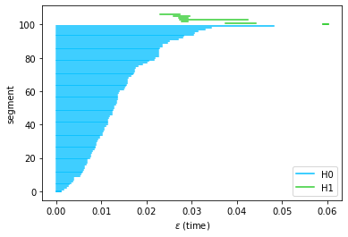

# Manifold Topology Divergence: a Framework for Deep Generative Models Evaluation

This is an implementation of the algorithms from the paper https://arxiv.org/pdf/2106.04024:

```
Barannikov, S., Trofimov, I., Sotnikov, G., Trimbach, E., Korotin, A., Filippov, A., & Burnaev, E. (2021).
Manifold Topology Divergence: a Framework for Comparing Data Manifolds. NeurIPS'21.
```

### Installation
1. Requires numpy, scipy, torch.
2. Install ripserplusplus:
```git clone https://github.com/simonzhang00/ripser-plusplus.git; cd ripser-plusplus; python setup.py install```
4. Install MTopDiv:
```git clone https://github.com/IlyaTrofimov/MTopDiv.git; cd MTopDiv; python setup.py install```

Alternatively, you can use dockerfile. It also contains implementations of other algorithms which were tested the paper (Geometry Score, FID, IMD).
In the docker, run ```conda activate py37``` after start. The directory ```MTopDiv/experiments``` contains jupyter notebooks with experiments from the paper.

```Example.ipynb``` can be executed in Google Colab. 

### Usage example
```python
import numpy as np
import mtd

np.random.seed(7)
P = np.random.rand(1000, 2)
Q = np.random.rand(1000, 2)

barc = mtd.calc_cross_barcodes(P, Q, batch_size1 = 100, batch_size2 = 1000)
```



```python
mtd.mtopdiv(P, Q, batch_size1 = 100, batch_size2 = 1000)
0.035247244
```
